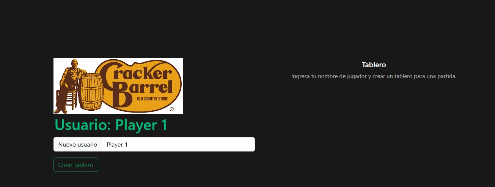
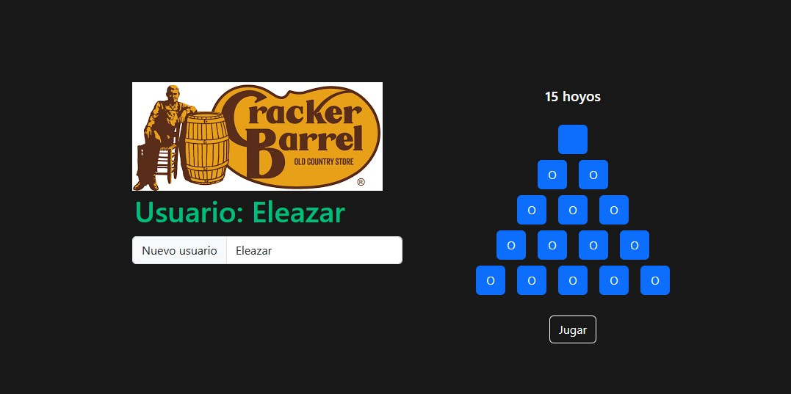
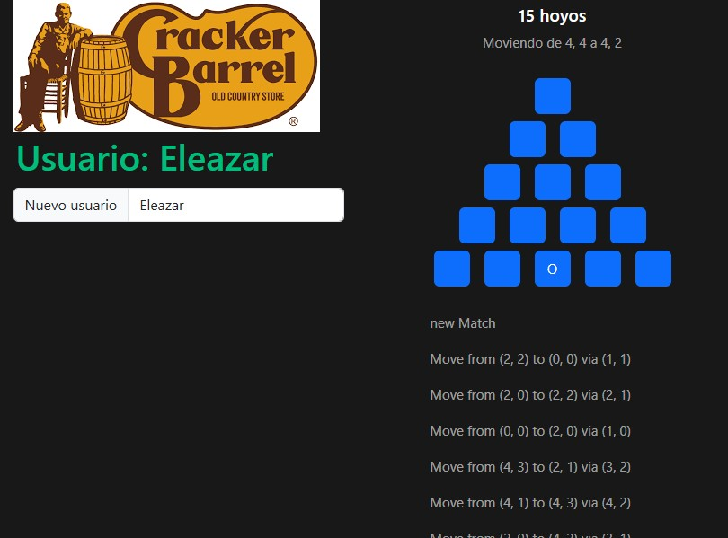

# peg-game
Solución para el juego "Cracker Barrel Peg Game" 15 hoyos


## Requisitos


- Instalar [Docker componse](https://docs.docker.com/compose/install/)


- Descargar aplican [peg game](https://github.com/eleazarchiuh/peg-game.git) desde github


## Recomendación
Los siguientes pasos y comandos fueron validados en una PC con sistema operativo Windows 11


## Levantar aplicaciones
Después de instalar docker compose y descargar el repositorio procedemos a ejecutar el siguiente comando


```sh
docker compose up --build -d
```


Validar que todos los contenedores fueron levantados
```
docker ps
```
Debemos poder ver 3 contenedores ejecutandose
```
c341d1274793   peg-game-frontend    0.0.0.0:5000->80/tcp     peg_game_vue
8858d29fd858   peg-game-backend     0.0.0.0:8080->8080/tcp   peg_game_java
9025486da132   mariadb:latest       0.0.0.0:3306->3306/tcp   local-mariadb
```


Ingresar a un navegador e ingresa la url http://localhost:5000/
Deberá cargar la aplicación como se muestra en la imagen



Para empezar el juego hay que ingresar un mombre, hacer click en el botón de crear tablero y deberá generar un tablero de 15 hoyos



Al hacer click en el botón Jugar, la aplicación empezará a mover las piezas hasta resolver el juego.


